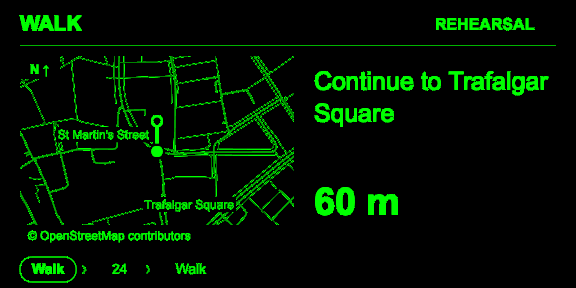

# Waypoint for Even G2

London walking and public transport guidance on Even G2: walk to the stop, follow the ride, get a bus stop reminder, then walk to your destination.

Waypoint is a separate Even Hub app built with React, TypeScript and the official SDK. Version **0.5.0** is a working prototype with browser and simulator verification. It has **not been tested on physical G2 glasses**.



## Try it locally

Use Node.js 22.18 or newer. No API keys or backend are required for the current pilot.

```sh
npm ci
npm run dev
```

Open [localhost:5173](http://localhost:5173). The planner starts with Trafalgar Square → Camden Town. Choose All transport, Bus or Walking, compare the returned routes, then start a journey. TfL may return fewer than three distinct alternatives.

To explore without sharing your location, choose **Preview a full journey**, or open [the full-trip rehearsal](http://localhost:5173/?rehearsal=full-trip). Press **Advance journey** to feed each synthetic GPS sample through walking, boarding, riding and the final walk. Stop names are illustrative; the rehearsal is not a timetable. Street maps still require a network request unless cached.

## What works

- TfL route search with up to three alternatives, departure and arrival times, walking minutes, changes and reported disruptions.
- North-up walking maps and route overviews using OpenStreetMap streets. If street data is unavailable, route geometry remains visible with a fallback label.
- A glasses stop timeline, live boarding predictions and bus reminders after passing the preceding stop. Urgent guidance takes priority over the map.
- Experimental automatic bus boarding and transition to the following walk, with undo and manual confirmation. Detection uses sustained movement along the route; it does not identify your vehicle.
- Connection estimates using remaining planned travel time and fresh, direction-matched predictions where available. A tight connection offers a new search from your location.
- Eight saved destinations, four-hour journey recovery and a seven-day cache of the most recently downloaded street area. The companion supports light and dark mode.

To save a destination, fill the **To** field and give it a name under **Saved destinations**. Phone shortcuts fill the planner. The idle glasses picker searches from your current location and lets you choose a route.

## Glasses controls

| State                        | Control                                                           |
| ---------------------------- | ----------------------------------------------------------------- |
| Routes or saved destinations | Swipe to choose; tap to select                                    |
| Walking                      | Tap to switch between local guidance and route overview           |
| Waiting                      | Tap to confirm boarding if automatic detection has not done so    |
| Riding                       | Tap through stop details, map and timeline; swipe to browse stops |
| Stop reminder                | Tap after pressing the bus stop button                            |
| Alighting                    | Tap to confirm you have got off                                   |
| Detection message            | Tap to undo the inferred transition                               |
| Manual arrival confirmation  | Tap to confirm; swipe to cancel                                   |
| Any journey view             | Hold to return to live guidance; double-tap to close the app      |

Browsing returns to live guidance after 12 seconds. The companion also has manual controls for missed transitions and uncertain location. Rail boarding requires confirmation.

## Run the simulator

Keep the development server running, then run:

```sh
npm run sim
```

To start at a particular journey state:

```sh
npm exec evenhub-simulator -- 'http://localhost:5173/?rehearsal=riding' --automation-port 9898
```

Other rehearsal states include `full-trip`, `boarding`, `detected`, `stop`, `requested`, `alighting`, `arrived`, `uncertain` and `walking`.

## Verify and package

```sh
npm test
npm run build
npm run pack
```

`npm test` runs the Node test suite. The build checks TypeScript and creates `dist/`. Packaging also builds, then writes `artifacts/waypoint-0.5.0.ehpk`.

The project pins SDK **0.0.16**, CLI **0.1.14** and simulator **0.9.5**. The manifest requires Even App **2.2.10** or newer explicitly, because the CLI's fallback compatibility map can be outdated.

The visual fixtures are at `tests/hud-gallery.html?case=riding`. The scripts in `scripts/` capture simulator frames and exercise gestures; they currently target macOS Apple Silicon and require Python with Pillow. See the [verification record](docs/verification.md) for commands, evidence and the limits of those checks.

## Test on G2

Follow [Even Hub's developer documentation](https://hub.evenrealities.com/docs) for account setup and installation. For local QR development:

```sh
npm exec evenhub -- qr --url http://YOUR_COMPUTER_LAN_IP:5173
```

Your phone must be able to reach that address. A browser on plain LAN HTTP may deny geolocation; the Even runtime uses the SDK location stream.

In an installed build, open **Device**, start the five-minute test, lock the phone and watch whether the counter continues updating on G2. Unlock and export the results. Record the phone, OS, Even App and glasses firmware versions alongside what you actually saw. Callback measurements alone do not prove an alert was visible.

Phone-lock endurance, Bluetooth reconnection, microphone delivery and stop-reminder timing still need hardware testing. Longer 30- and 90-minute observations are also outstanding; the built-in diagnostic lasts five minutes. The package has not been uploaded or accepted for distribution.

## Current limits

Connection margins use planned travel time, not a continuously corrected onboard ETA. Stop predictions do not establish which vehicle you boarded. Slow traffic, short bus legs and ambiguous paths can require manual confirmation.

Precise reminders require a validated stop sequence and recent, accurate location. Old, inaccurate, off-route or implausibly jumping fixes suppress them. Underground progress and alert delivery are not guaranteed.

New routes and live departures need connectivity. Cached guidance is not offline route calculation. Maps are north-up, cover named streets within a bounding box of at most 12 km diagonal, and accept up to 12,000 ways. Only one street area is retained, provided its JSON fits the two-million-character limit.

Voice destinations, tools for the built-in Even AI, National Rail delay-feed integration, automatic disruption rerouting and global coverage are not implemented. National Rail can appear in a TfL itinerary; this is not a Darwin integration. The microphone button is a ten-second byte-count diagnostic, not voice control.

## Data and privacy

There is no backend, account system or analytics. Searches send the origin and destination to TfL; map requests send the route's bounding area to the public Overpass service. Both services receive requests directly from the client. Anonymous TfL access and public Overpass are pilot dependencies; broader deployment needs a provider and quota strategy. No provider secrets are embedded.

Saved destinations, street geometry and the active journey stay in local storage. Journey recovery includes the last location; ending the journey removes that session. Continuous location tracking runs only during an active real journey or device test. Current-location and saved-destination searches request a single fix. Audio is neither stored nor uploaded; diagnostic exports omit coordinates and device serial numbers.

Transport data comes from [TfL Open Data](https://tfl.gov.uk/corporate/terms-and-conditions/transport-data-service). Map data is © [OpenStreetMap contributors](https://www.openstreetmap.org/copyright), under ODbL. Maps use Overpass geometry rather than prefetched public raster tiles.

## Working on the code

| Files                                            | Responsibility                                                |
| ------------------------------------------------ | ------------------------------------------------------------- |
| `journey.ts`, `geo.ts`, `model.ts`               | Journey transitions, location confidence and geometry         |
| `tfl.ts`, `connections.ts`                       | Provider parsing, stop validation and connection estimates    |
| `hud.ts`, `renderHud.ts`                         | Display state and the shared 576 × 288 canvas renderer        |
| `glasses.ts`                                     | SDK connection, gestures, location and changed-image delivery |
| `streetMap.ts`, `useStreetMap.ts`, `storage.ts`  | Street maps, cache lifecycle and saved state                  |
| `useWaypoint.ts`                                 | Requests, subscriptions and user actions                      |
| `App.tsx`, preview components, `DevicePanel.tsx` | Planner, companion display and diagnostics                    |

Source files live in `src/`. Behavioral tests live in `tests/` and use saved TfL responses plus synthetic location traces. Keep external data validation and cancellation at their existing boundaries; the glasses preview and native display share one renderer.

For background, read the [research plan](docs/research/2026-10-03-g2-transit-plan.md), [implementation history](docs/implementation.md) and [cleanup audit](docs/cleanup-audit.md).
